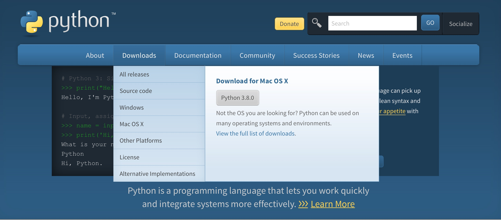

# 安装Python解释器

## 下载和安装

1. 打开官网：https://www.python.org

2. 下载Python版本，如图所示：



3. 按照步骤安装

## 使用

### 解释器

```python
>>> print("Hello,world!")
```

### IDLE

```python
>>> print("Hello,world!")
```

## pip的使用

```shell
pip install requests
```

### 换源

换清华源。

## 注意

- 官方下载Python速度很慢，找解决方案。
- IDLE可能会报错"IDLE can't import Tkinter. Your Python may not be configured for Tk"，注意场景及解决方案。也可考虑不讲IDLE。
