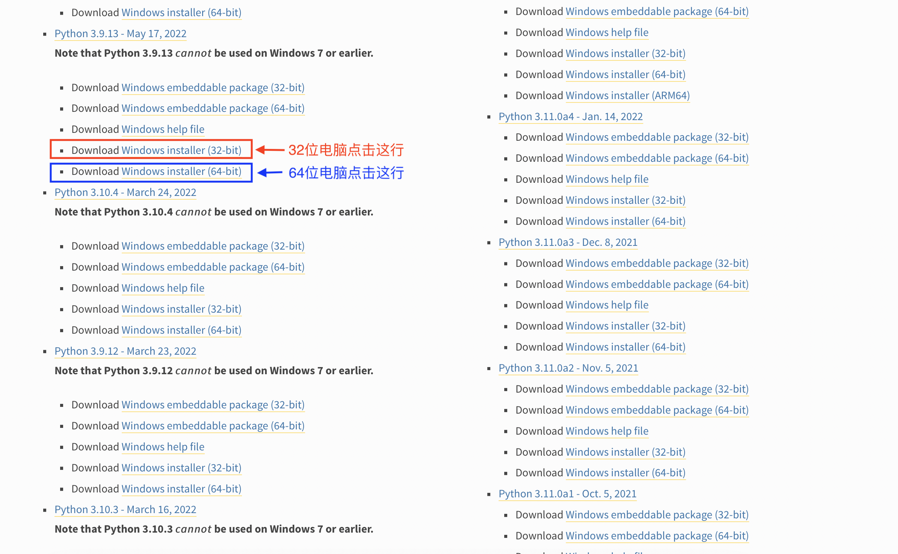

# 安装Python解释器

## 下载和安装

1. 打开官网（https://www.python.org/）
，可以看到如下菜单栏。确定电脑系统的型号，Windows系统电脑点击Windows，Apple生产的电脑点击macOS。


2.选择合适的版本和文件包进行下载。在上一步后，会看到如下图所示的界面，这里以windows为例。

 

版本号一般为"X.X.X"格式，常说的Python版本3.8、3.9和3.10等，
指的是版本号的前两位,在决定好是3.X后，选择提供下载文件的最新版本。
**建议选择3.8+的，本教程将选用3.9作为示例。**

比如，3.9.16虽然是最新的版本，但并无可供下载的文件，因此继续向下寻找，找到可以下载的3.9.13，如下图所示。



根据电脑系统位数下载相应的installer即可。
    
接下来以macOS为例，在第一步中选择mac后，显示的界面与上述第二张图片相似，但是其页面的3.9.13版本不同，如下图所示。


根据macOS的芯片情况点击相应的版本进行下载。

3. 安装Python。在下载完Python安装包后，双击打开。按照安装器提示，完成即可。但windows注意以下几点：
   
   - 如果选择custom 安装有一些选项，最重要的是add path，建议安装到all users（指计算机有多个账号）。注意不要把路径放在根目录，比如D盘，需要自己给个文件夹。Python会安装文件到设置的目录为根目录。
   - 安装完测试python解释器。Windows自带搜索栏搜索CMD或者命令提示符。输入python，返回的页面应该是XXX。exit()回车。
   - 测试pip是否可用，命令栏输入pip install requests。pip如果出现网络问题，需要换清华的源。


## 使用

### 解释器

```python
>>> print("Hello,world!")
```

### IDLE

```python
>>> print("Hello,world!")
```

## pip的使用

```shell
pip install requests
```

### 换源

换清华源。
Python 换源，在终端输入以下命令行
```shell
pip config set global.index-url https://pypi.tuna.tsinghua.edu.cn/simple
```

## 注意

- 官方下载Python速度很慢，找解决方案。

- IDLE可能会报错"IDLE can't import Tkinter. Your Python may not be configured for Tk"，注意场景及解决方案。也可考虑不讲IDLE。
