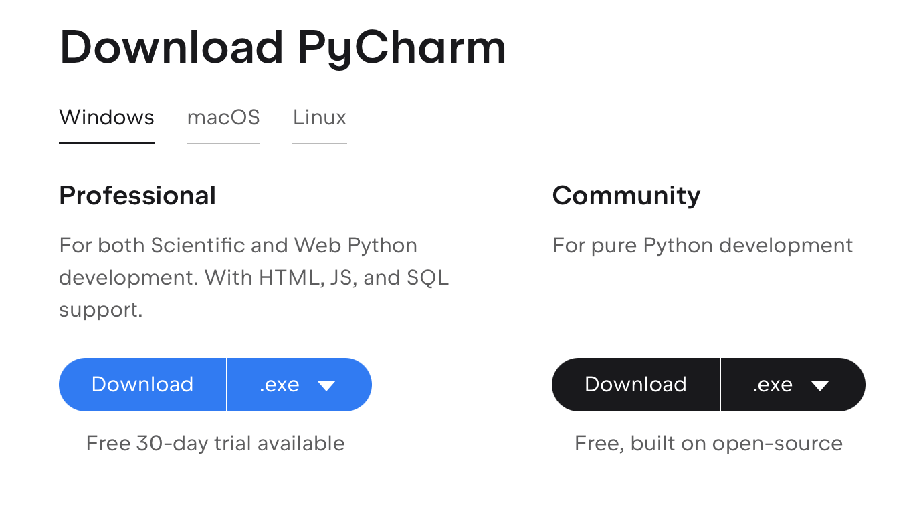
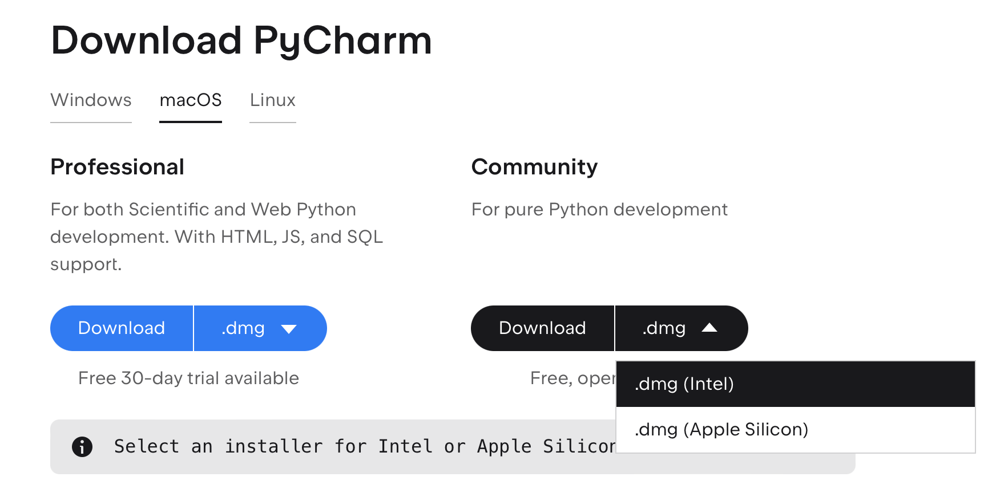

# 安装PyCharm

## 下载

可选方案：

1. 官网(https://www.jetbrains.com/pycharm/download/#section=windows) 下载安装。注意事项和Python一致，选择适合自己系统的版本，如下图所示。

 

Profesional版本需要购买license或者通过教育版license认证免费获取；Community版本对所有用户免费使用。根据自己的能力和需求下载其中任意一个即可。

2. Homebrew(macOS系统适用): https://formulae.brew.sh/cask/pycharm-edu

## 安装

双击安装包，按操作提示即可。

## 试用

在正式使用Pycharm之前，需要对其进行一些配置。

## 申请PyCharm教育版许可证

高校师生可以申请PyCharm教育版许可证，从而获得免费的Professional版本的许可证。步骤如下：

1. 注册一个JetBrains账号,尽量使用学校的edu邮箱注册。但如果没有，普通邮箱即可。
2. 收到邮件，点激活。
3. 在个人中心点进License，开始申请。
4. 填写表单。
   - 名字最好填真实姓名。
   - No available license，点击students。点Apply Now。
   - 学生证明文件可使用学信网验证码
5. 点击Apply，等待邮箱收到License即可。

