# 安装PyCharm

这里首先介绍IDE的概念。

IDE即Integrated Development Environment，是集成开发环境的意思。是用于提供程序开发环境的应用程序，集成了代码编写功能、分析功能、编译功能、调试功能等一体化的开发软件服务。

PyCharm是最受欢迎的Python IDE之一，其带有一整套可以帮助用户在使用Python语言开发时提高其效率的工具，比如： 调试、语法高亮、Project管理、代码跳转、智能提示、自动完成、单元测试、版本控制等等。
## 下载

可选方案：

1. 官网(https://www.jetbrains.com/pycharm/download/#section=windows) 下载安装。选择适合自己系统的版本，如下图所示。

 

Community版本对所有用户免费使用。对于日常学习的用户来说够用了，这里根据Community版本进行下载。

2. Homebrew(macOS系统适用): https://formulae.brew.sh/cask/pycharm-ce

## 安装

下载完成后，双击安装包并按照提示安装。

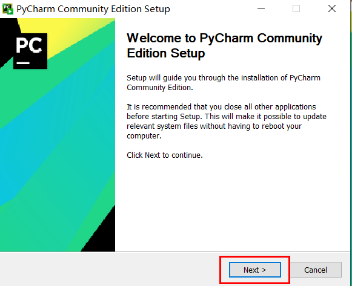

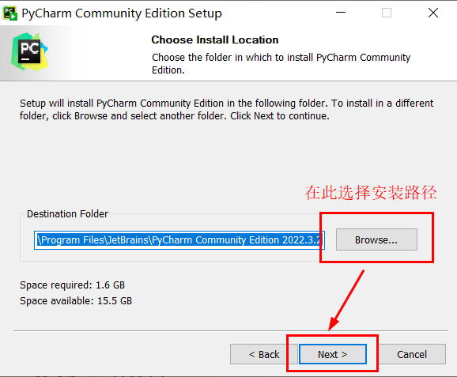

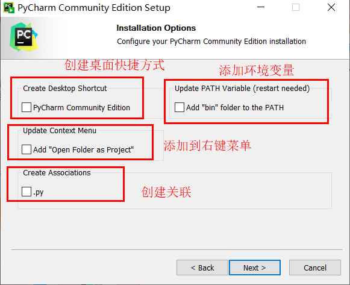

注意上图中都不是强制勾选的（都不选择也可以正常编译），可以根据自己的需要选择。

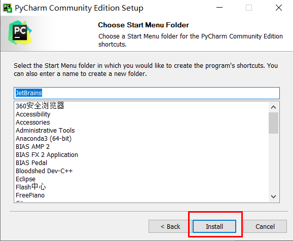

选择“开始”菜单文件夹。
 
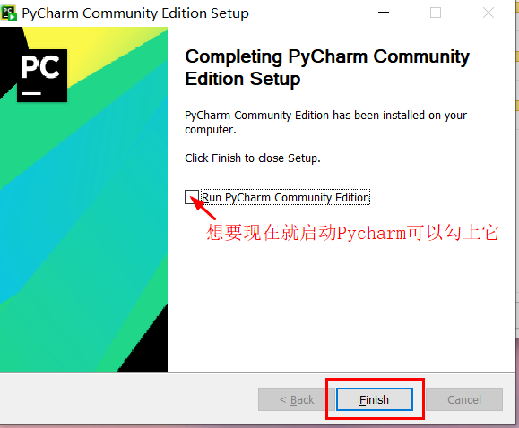 

点击“Finish”就可以完成安装了。

## 配置及试用

接下来用Pycharm帮助你开启第一个Python程序吧。

1. 安装完成后，启动 PyCharm。

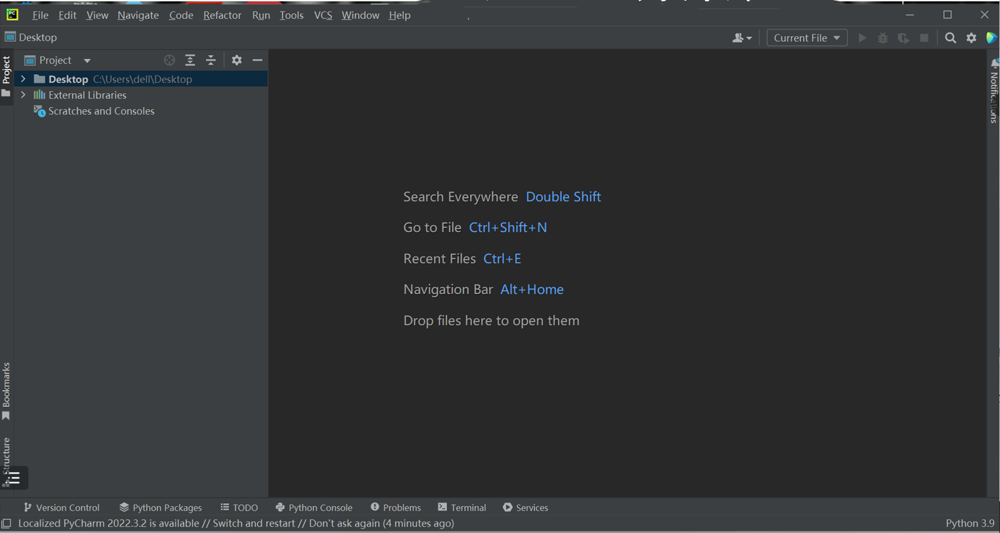

2.  创建新项目。选择 "Create New Project" , 选择相应的解释器和项目路径，并给你的项目取个名字。

这里通过“File”->“New Project”新建一个工程项目。

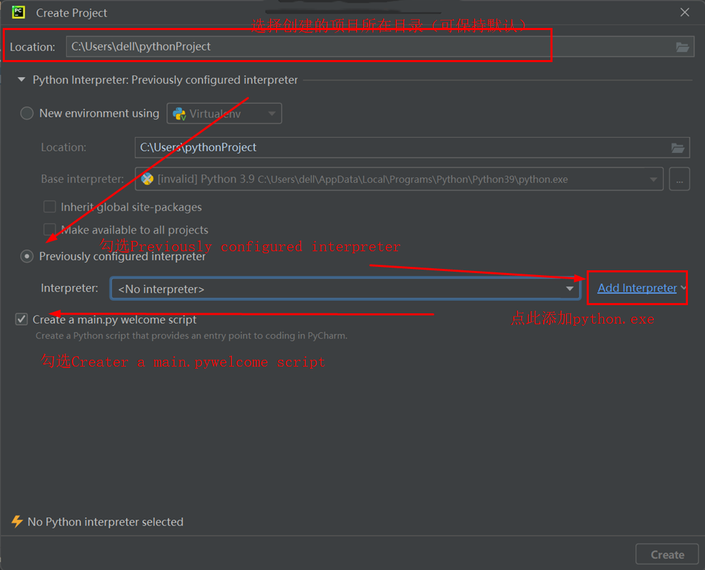

Pycharm第一次使用时要先进行解释器安装，这就用到我们在1.2.2中安装好的Python解释器了。
选择创建的项目所在目录，然后进行解释器安装。这里我们选上了“Create a main.py welcome script”，之后打开项目时PyCharm就会自动为我们写好一个“Hi,Pycharm”程序！
在点击“Add Interpreter”会出现下图界面，请按照图中操作。

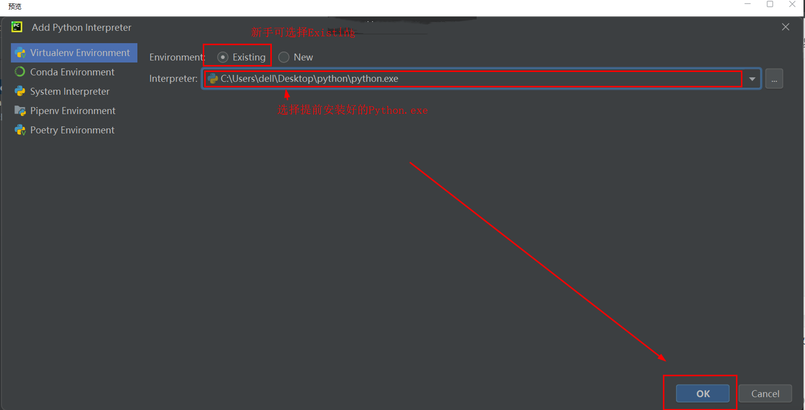

点击“Add Interpreter”会出现上图界面，按照图中操作。

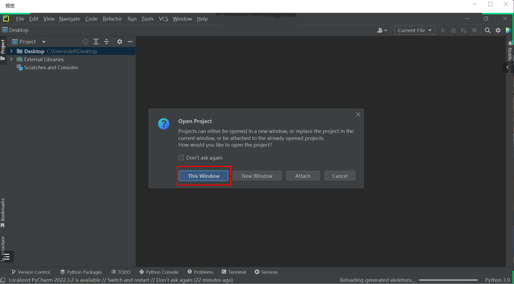

点击“This Window” ，PyCharm便会在这个窗口上生成新的项目了，接下来运行一下试试吧。

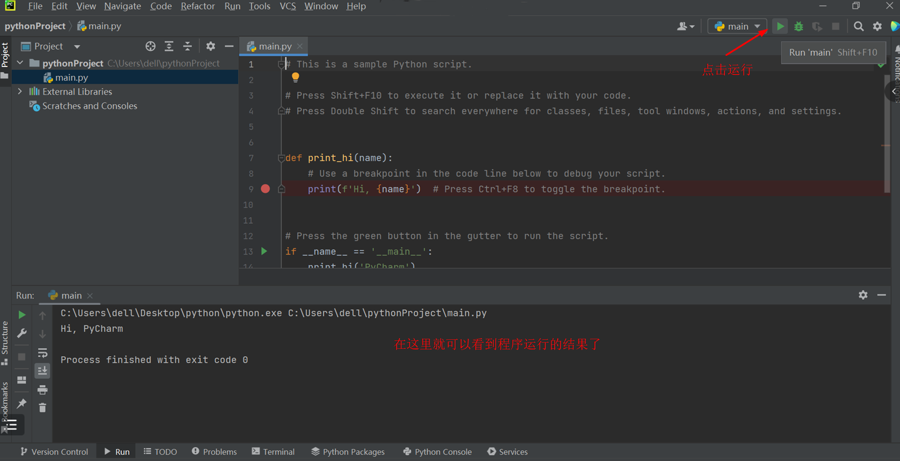

现在可以开始自己的编码了。

注意在 PyCharm 中创建新文件时，请确保选择 Python 作为文件类型。

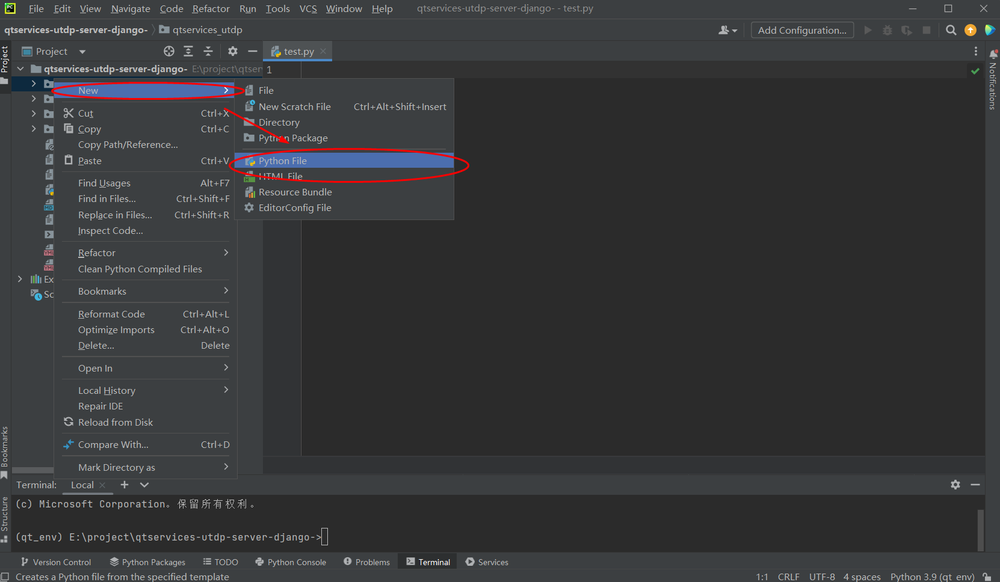

