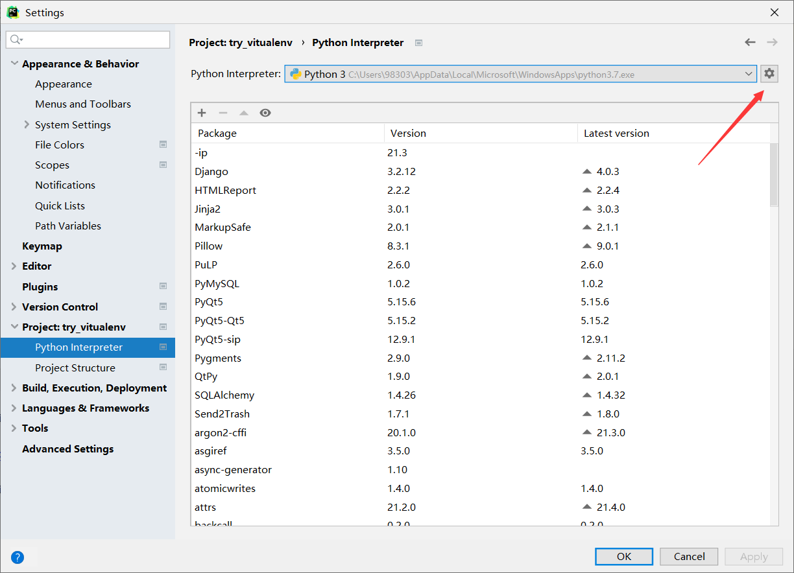
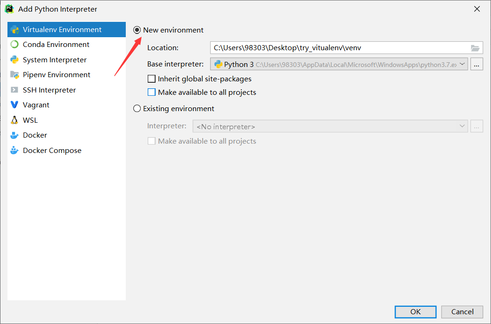
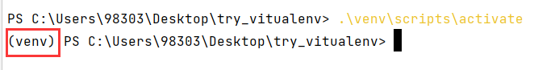

# 虚拟环境

## 大纲

1. 虚拟环境介绍
2. pip基础知识
3. virtualenv配置虚拟环境
4. pipenv配置虚拟环境
5. 虚拟环境的原理

## 虚拟环境介绍
许多人接触**虚拟环境**时第一感觉就是抵触，配置环境都想着能简单就简单，为啥好好的本地真实环境不用要用虚拟环境？
但其实使用虚拟环境的好处有很多，包括但不仅限于以下三点：

- 所有的项目的库都放到一个地方容易混乱，而且比较冗余，毕竟不是所有的项目都需要那么多的库。

- 因为工作以后都是分工协作的，这个项目能在你电脑上运行，但是到了别人那如果没有安装相应的库就无法运行，所以需要大家能够在库上进行同步。

- 不同的项目对同一个库版本要求不一样，如果A项目要求一个库的版本低，B项目的要求同一个库版本高，运行B项目升级了这个库覆盖前一个版本，就会导致A项目无法运行。

## pip基础知识
我相信很多小伙伴跟我一样，最开始接触计算机的时候也没有管理好自己安装目录的习惯，所有的都是默认目录然后下载下来，
反正能跑就行。但是但凡出了问题，就会照着网上的教程这找那找，不知道问题出在哪儿。下面我将教大家怎么管理好python的目录。

### 概念理解

- Terminal: 命令模式（相当于在当前打开文件所在目录打开了cmd，进行环境切换、pip命令安装等）
- python console: 交互模式（相当于在当前打开文件所在目录打开了Python解释器，故可以直接在Console里继续写入代码执行），方便代码调试。
- windows的cmd: 系统的一种命令行操作工具，用户可以通过输入命令来完成各种各样的系统或程序操作。

简而言之，terminal和cmd的功能一样，是和操作系统打交道的，console是和python代码打交道的，
我们的pip是安装第三方库的，因此可以在cmd和terminal里面运行。

### 找到python目录
在cmd或者terminal里面输入以下代码：
```pycon
python -m site
```
正常输出结果如下：
```pycon
sys.path = [
    'C:\\Users\\98303',
    'C:\\Program Files\\WindowsApps\\PythonSoftwareFoundation.Python.3.7_3.7.2544.0_x64__qbz5n2kfra8p0\\python37.zip',
    'C:\\Program Files\\WindowsApps\\PythonSoftwareFoundation.Python.3.7_3.7.2544.0_x64__qbz5n2kfra8p0\\DLLs',
    'C:\\Program Files\\WindowsApps\\PythonSoftwareFoundation.Python.3.7_3.7.2544.0_x64__qbz5n2kfra8p0\\lib',
    'C:\\Program Files\\WindowsApps\\PythonSoftwareFoundation.Python.3.7_3.7.2544.0_x64__qbz5n2kfra8p0',
    'C:\\Users\\98303\\AppData\\Local\\Packages\\PythonSoftwareFoundation.Python.3.7_qbz5n2kfra8p0\\LocalCache\\local-packages\\Python37\\site-packages',
    'C:\\Users\\98303\\AppData\\Local\\Packages\\PythonSoftwareFoundation.Python.3.7_qbz5n2kfra8p0\\LocalCache\\local-packages\\Python37\\site-packages\\win32',
    'C:\\Users\\98303\\AppData\\Local\\Packages\\PythonSoftwareFoundation.Python.3.7_qbz5n2kfra8p0\\LocalCache\\local-packages\\Python37\\site-packages\\win32\\lib',
    'C:\\Users\\98303\\AppData\\Local\\Packages\\PythonSoftwareFoundation.Python.3.7_qbz5n2kfra8p0\\LocalCache\\local-packages\\Python37\\site-packages\\Pythonwin',
    'C:\\Program Files\\WindowsApps\\PythonSoftwareFoundation.Python.3.7_3.7.2544.0_x64__qbz5n2kfra8p0\\lib\\site-packages',
]
USER_BASE: 'C:\\Users\\98303\\AppData\\Local\\Packages\\PythonSoftwareFoundation.Python.3.7_qbz5n2kfra8p0\\LocalCache\\local-packages' (exists)
USER_SITE: 'C:\\Users\\98303\\AppData\\Local\\Packages\\PythonSoftwareFoundation.Python.3.7_qbz5n2kfra8p0\\LocalCache\\local-packages\\Python37\\site-packages' (exists)
ENABLE_USER_SITE: True
```

1.我们看见这里的USER_BASE 和USER_SITE其实就是用户自定义的启用Python脚本和依赖安装包的基础路径。

2.其中USER_BASE表示就是在C盘这个目录下的Python.exe启动程序路径以及pip,esay-install,markdown等脚本

3.其中的USER_SITE其实就是用户如果调用C盘路径下的python.exe中的脚本pip文件去下载，就会将site-package的默认安装到这个C盘路径下。

## virtualenv配置虚拟环境
### 方法一：直接在terminal或者cmd中配置
新建一个项目文件夹，右键用pycharm打开，直接在terminal里面输入：
```pycon
python -m venv venv
```
一会后我们可以看见我们的工作目录中看到多出一个venv文件夹，再输入以下代码激活虚拟环境：
```pycon
.\venv\scripts\activate
```
这样最简单的虚拟环境配置就做好了。
### 方法二：在pycharm的设置中配置
工具栏: File -> Setting -> Project -> python interpreter

这个界面显示了该文件夹所包含项目所使用的python解释器和相应的第三方库。



点击小齿轮，add。



选择new environment，有两个选项可选：

- inherit global site-packages:勾选上的话代表创建的新项目需要copy一份全局包到虚拟环境。
- Make available to all projects:勾选上，表示，当在虚拟环境下安装包的时候，copy一份到全局

我们如果想用我们以前安装过的包，就勾选第一个；如果我们想在虚拟环境安装的包也能在全局使用，则勾选第二个。
完成后点击OK。

再在terminal输入以下代码激活虚拟环境：
```pycon
.\venv\scripts\activate
```



出现以上小括号则说明虚拟环境搭建成功！！

### 导出安装的库
前面说到，安装虚拟环境的好处有一点是能与别人协同，别人只需要安装好我们虚拟环境安装的库便能跑我们的代码。

具体实现可以在terminal里面输入以下代码：
```pycon
pip freeze > requirements.txt
```
之后我们便能看见我们虚拟环境目录下新增了一个requirements.txt文件，打开看里面就有我们安装的所有库及其版本信息。
别人拿到我们的requirements文件之后，只需要把这文件放在Scripts文件夹下，并且输入：
```pycon
pip install -r requirements.txt
```
之后就可以发觉自动安装上了我们项目所需要的库。

## pipenv搭建虚拟环境
使用pipenv搭建虚拟环境需要安装pipenv库，在terminal里面输入：
```pycon
pip install pipenv
```
之后我们可以在当前文件夹下建立一个.venv文件夹，这样我们安装虚拟环境会优先安装到该文件夹下，
否则会安装到我们C盘的user目录里面。
```pycon
pipenv install
```
虚拟环境顺利搭建成功，我们可以看到在文件夹.venv中看到了我们的虚拟环境。

在当前文件夹下创建虚拟环境文件夹的同时，还创建了两个文件Pipfle和Pipfile.lock，这两个文件用于管理依赖。
作用等同与上一个方法中的requirements.txt，不过好处是不许要手动维护，在安装python库时会自动更新两个文件。
前者用来记录项目依赖包列表，而后者记录了固定版本的详细依赖包列表。当我们使用pipenv 安装/删除/更新依赖包时，二者自动更新。

我们打开pipfile文件，将下载源改为清华的镜像源
```pycon
url = "https://pypi.tuna.tsinghua.edu.cn/simple"
```

当我们想下载第三方库比如pandas时，输入：
```pycon
pipenv install pandas
```

激活虚拟环境时，需要输入：
```pycon
pipenv shell
```
注意：这时不会出现诸如(venv)之类的标识，所以很容易忘记是否在虚拟环境之中，
这是笔者认为pipenv不好用的原因之一。

当我们想运行某个py文件时，输入：
```pycon
pipenv run python draft.py
```
注意：如果我们直接使用pycharm的运行功能，会默认使用默认解释器和第三方库运行该文件！
这也是笔者认为pipenv不好用的原因之一。

## 常见问题
1、python -m site报错
如果提示如下：
```pycon
'python' 不是内部或外部命令，也不是可运行的程序或批处理文件。
```
则说明你python解释器的环境变量中不包含python.exe文件，下面我们则需要配置环境变量。

先打开cmd，输入：
```pycon
where python
```
会返回一个python.exe的地址：
```pycon
C:\Users\98303\AppData\Local\Microsoft\WindowsApps\python.exe
```
我们把这个地址复制后配置到环境变量去，再重新打开terminal或者cmd，输入python -m site就可以了

